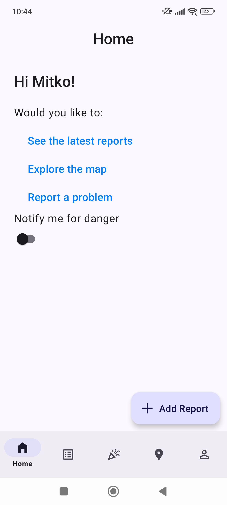
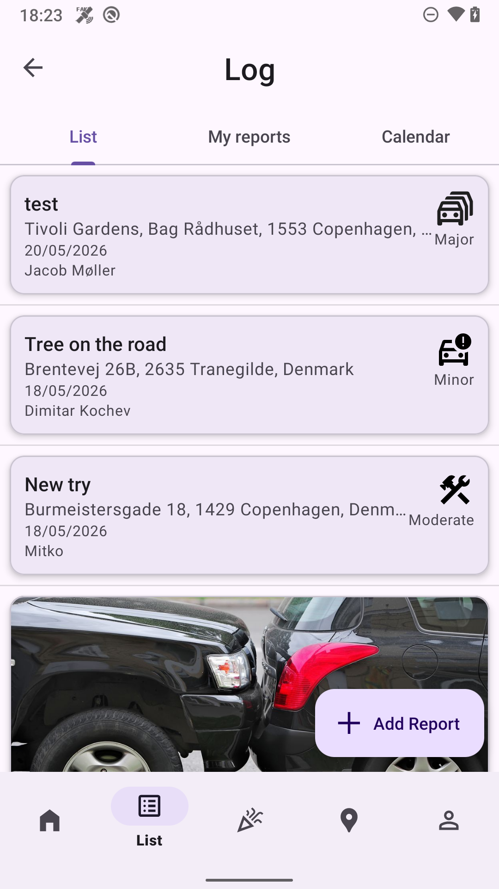
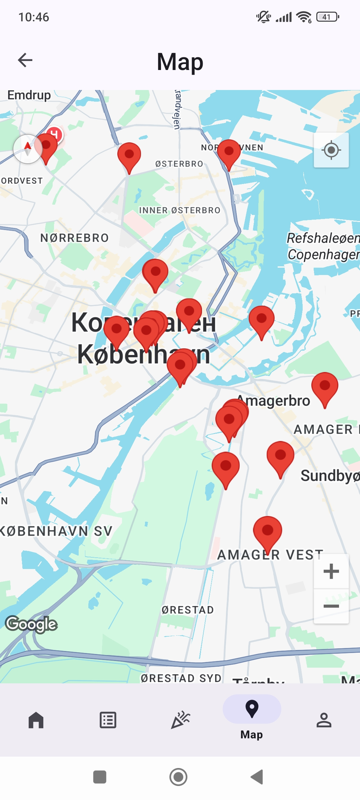
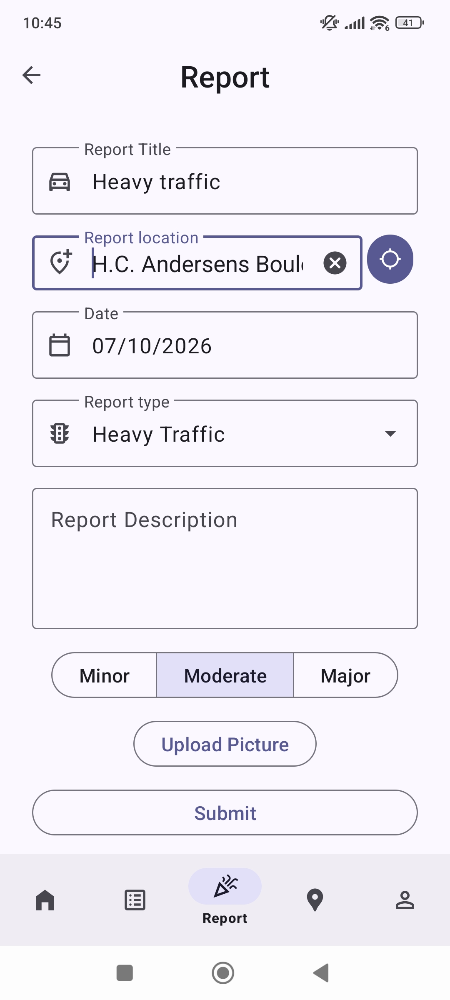

# X9 — Road Hazard Reporting for Android

A community-driven Android app for reporting and discovering road hazards—accidents, heavy traffic, roadworks, police presence—with live map visualization, photo evidence, and geofenced proximity alerts.

Built in Kotlin for the Mobile App Development course at the IT University of Copenhagen.

Mobile App development, Spring 2026

<table>
  <tr>
    <td align="center"><br><sub>Home page with shortcuts to the main features</sub></td>
     <td align="center"><br><sub>Report log with all active reports</sub></td>
    <td align="center"><br><sub>Map for displaying the geographical location of reports</sub></td>
    <td align="center"><br><sub>Report page for submitting a reposrt</sub></td>
  </tr>
</table>

---

## Features

| | |
|---|---|
| **Hazard reporting** | Submit reports with type (incident, heavy traffic, maintenance, police, other), severity, description, date, and location |
| **Photo evidence** | Capture with CameraX or pick from the gallery; images upload to Firebase Storage and are loaded with Glide |
| **Address autocomplete** | Geoapify geocoding resolves typed addresses to coordinates, and reverse-geocodes map taps back to street addresses |
| **Live map** | Google Maps with custom styling and per-type hazard markers; tapping a marker opens a detail bottom sheet |
| **Geofenced alerts** | Reports register geofences so users are notified on approach. Expiry is derived from hazard type and severity — a *minor incident* clears after an hour, *major maintenance* persists for three days |
| **Report log** | Tabbed history with a scrollable list and a calendar view; selecting a date surfaces that day's reports in a bottom sheet |
| **Swipe to edit/delete** | `ItemTouchHelper` gestures on the report list with custom swipe visuals |
| **Authentication** | Firebase Auth via FirebaseUI, with per-user report ownership |
| **Profile & settings** | Report counters maintained transactionally, profile picture selection, theme and preference handling |
| **Adaptive UI** | Material 3 theming, dark mode via `values-night`, and dedicated landscape layouts |

---

## Architecture

The app is a single-activity, multi-fragment application with a repository layer isolating all Firebase access.

```
ui/            Fragments, activities, adapters, bottom sheets, Compose settings screen
  ├── auth/          FirebaseUI sign-in
  ├── main/          MainActivity + home, map, profile, report, reportLog fragments
  ├── camera/        CameraX capture and gallery selection
  ├── list/          RecyclerView adapter, swipe handling, bottom sheets
  └── settings/      Jetpack Compose settings screen
data/          ReportRepository, UserRepository, StorageRepository, GeofenceManager
model/         Report, User
services/      GeoapifyService (OkHttp + coroutines)
media/         PhotoCaptureManager
broadcasts/    GeofenceReceiver
cameraX/       CameraXController
permisions/    CameraPermissionHelper
```

**Notable choices**

- **Repository pattern.** `ReportRepository` and `UserRepository` wrap Firebase Realtime Database and Storage so no fragment touches Firebase directly. Dependencies are constructor-injected with defaults, which keeps them substitutable for testing.
- **Denormalised query keys.** Reports store a `sortableDate` (`yyyy-MM-dd`) alongside the display date and a composite `locationKey`, so Realtime Database — which has no compound querying — can still filter by date and location.
- **Transactional counters.** User report counts are updated through Firebase transactions rather than read-modify-write, avoiding lost updates under concurrency.
- **ViewModels for cross-fragment state.** `CameraViewModel` is scoped to the activity so a photo captured in the camera fragment survives navigation back to the report form.
- **Views + Compose side by side.** The main flows use View binding and XML layouts; the settings screen is Jetpack Compose with Material 3, demonstrating interoperability.

---

## Tech stack

Kotlin · Android SDK 23–36 · Gradle (Kotlin DSL) with version catalogs
Firebase Auth, Realtime Database, Storage, FirebaseUI · Google Maps & Play Services Location
CameraX · Jetpack Navigation · ViewModel & Lifecycle · Jetpack Compose (Material 3) · Glide · OkHttp · Geoapify
detekt + ktlint for static analysis

---

## Getting started

### Prerequisites

- Android Studio Otter 3 Feature Drop | 2025.2.3
- JDK 11
- A device or emulator running API 23+ with Google Play services
- A Firebase project
- API keys for [Google Maps](https://developers.google.com/maps/documentation/android-sdk/get-api-key) and [Geoapify](https://www.geoapify.com/)

### Setup

The final version of the app lives in **`X9 V10/`** — open that directory in Android Studio, not the repository root.

**1. Firebase.** Create a project in the [Firebase console](https://console.firebase.google.com/), register an Android app with the package name `dk.itu.moapd.x9.diko`, and download `google-services.json` into `X9 V10/app/`. This file is deliberately not committed. Then enable:
- Authentication → the sign-in providers you want <!-- TODO: list which ones, e.g. Email/Password and Google -->
- Realtime Database → with rules restricting reads and writes to authenticated users
- Storage → for report images

**2. API keys.** Add to `X9 V10/local.properties` (git-ignored):

```properties
MAPS_API_KEY=your_google_maps_key
GEOAPIFY_API_KEY=your_geoapify_key
```

The Maps key is injected into the manifest by the Secrets Gradle plugin; the Geoapify key is exposed to Kotlin as a `BuildConfig` field.

**3. Build and run.**

```bash
cd "X9 V10"
./gradlew assembleDebug
./gradlew installDebug
```

### Code quality checks

```bash
./gradlew detekt ktlintCheck
```

> **Note:** `app/build.gradle.kts` points detekt at `../config/detekt/detekt.yml`, which isn't present in the repository. Either add the config file or drop the `config.setFrom(...)` line to fall back to detekt's defaults.

### Database schema

```
reports/{reportId}
  userId, title, type, severity, description,
  location, latitude, longitude, locationKey,
  date, sortableDate, imageRef, createdAt, updatedAt

users/{userId}
  username, email, numReports
```

---

     
## Development history

The project was built iteratively, and each milestone is preserved as a git tag:

| Tag | Milestone |
|---|---|
| [`v2-ui-basics`](../../tree/v2-ui-basics) – [`v4-stable`](../../tree/v4-stable) | UI foundations, fragments, navigation, landscape layouts |
| [`v5-pre-firebase`](../../tree/v5-pre-firebase) | Report model and list handling |
| [`v7-firebase-maps`](../../tree/v7-firebase-maps) | Authentication, Realtime Database, Maps |
| [`v8-photos`](../../tree/v8-photos) | Photo capture, upload and display |
| [`v9-geofence`](../../tree/v9-geofence) | Geofencing and proximity alerts |
| [`v10-final`](../../tree/v10-final) | Final version |
---


---

## Attribution

Course exercises and examples by the course instructor provided the starting point for several components — the Firebase repository pattern, the maps fragment, the swipe-to-delete handler, and the CameraX setup. These are marked in KDoc comments on the relevant classes, along with the places where AI assistance was used, as required by the course's academic integrity policy.

Instructor: [Fabricio Batista Narcizo](https://www.fabricionarcizo.com/)

## Author

**Dimitar Kochev** — diko@itu.dk
IT University of Copenhagen
Program: Bachelor in Data Science
